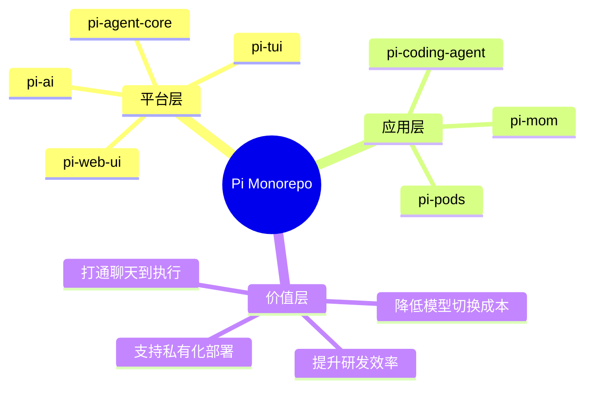
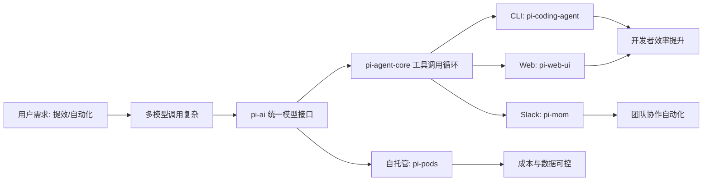
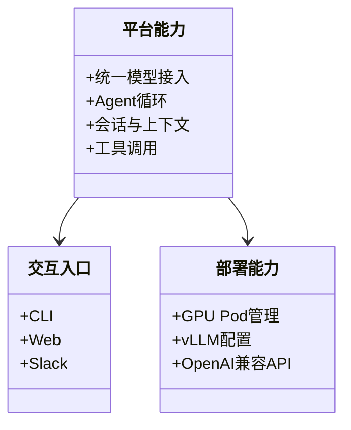
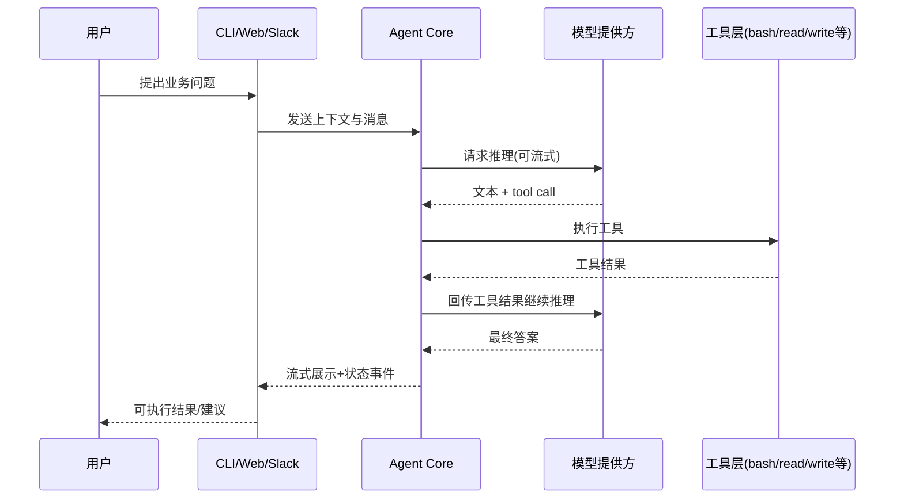
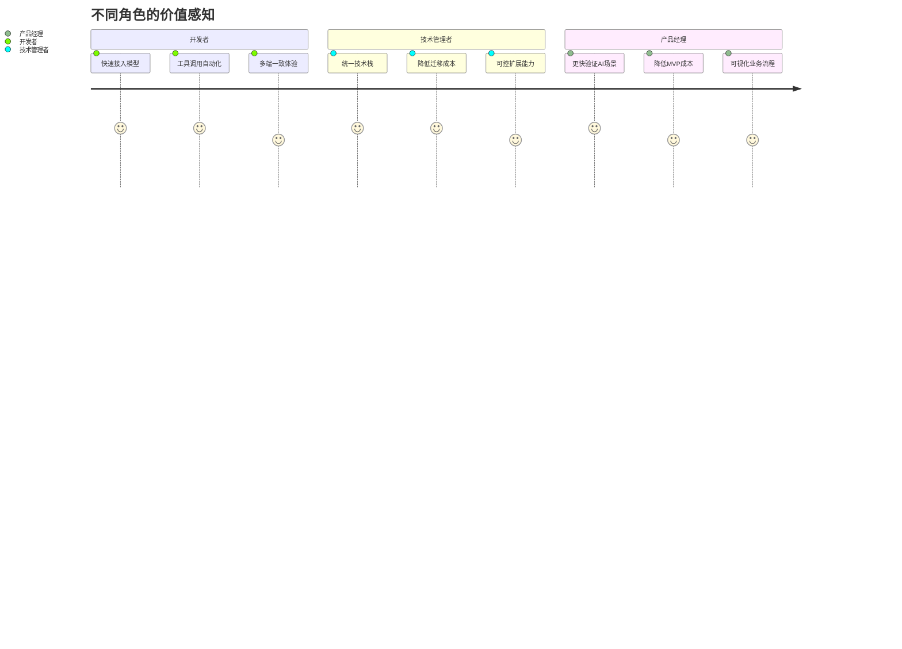
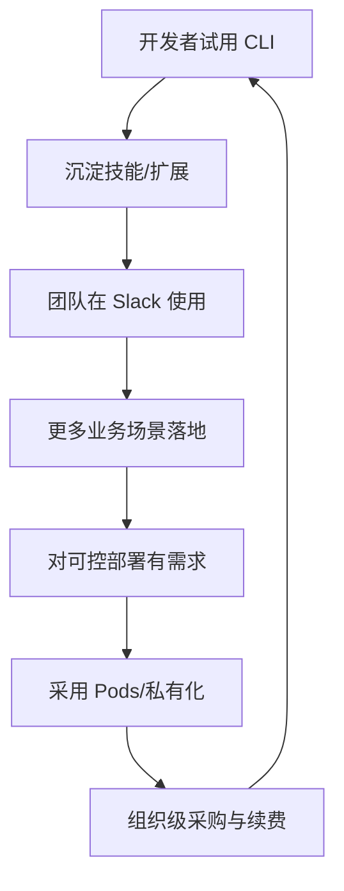

# Pi Monorepo 业务全景（面向产品经理）

## 目录

- [1. 一句话定义](#1-一句话定义)
- [2. 这个仓库到底在解决什么业务问题](#2-这个仓库到底在解决什么业务问题)
- [3. 产品矩阵与角色分工](#3-产品矩阵与角色分工)
- [4. 端到端业务闭环](#4-端到端业务闭环)
- [5. 核心价值主张（给谁、解决什么）](#5-核心价值主张给谁解决什么)
- [6. 商业化与增长抓手](#6-商业化与增长抓手)
- [7. 结论](#7-结论)
- [8. 可执行建议](#8-可执行建议)

## 1. 一句话定义

Pi Monorepo 是一个“AI Agent 产品家族”的底层平台与上层应用集合：既能作为开发者工具（CLI/Web），也能作为团队自动化助手（Slack Bot），还包含模型部署能力（GPU Pod + vLLM）。

## 2. 这个仓库到底在解决什么业务问题

### 2.1 典型客户痛点

- 多模型时代下，团队被不同 API、鉴权、上下文格式割裂，研发成本高。
- 仅有“问答型 AI”无法真正落地，缺乏“工具调用 + 执行动作 + 结果回写”的闭环。
- AI 助手如果只能在单终端使用，难以融入团队协作（如 Slack 线程、共享上下文）。
- 上云模型成本与可控性难平衡：公有 API 快，但成本、隐私和可控性受限；自托管复杂。

### 2.2 Pi 的业务解法

- 用 `pi-ai` 统一多模型调用和上下文/工具标准，减少供应商锁定。
- 用 `pi-agent-core` 提供“可持续对话 + 工具调用 + 事件流”的执行型 Agent 循环。
- 用 `pi-coding-agent` 和 `pi-web-ui` 形成 CLI 与 Web 端产品触点。
- 用 `pi-mom` 将 Agent 接入 Slack，把个人助手升级为团队协作助手。
- 用 `pi-pods` 打通“自建模型推理服务”能力，覆盖成本/数据主权诉求。

## 3. 产品矩阵与角色分工

| 模块 | 产品定位 | 主要用户 | 业务价值 |
|---|---|---|---|
| `packages/ai` | 多模型统一接口层 | 平台研发、AI 工程师 | 降低接入与切换成本 |
| `packages/agent` | Agent 执行引擎 | 应用研发 | 构建可执行型 AI 流程 |
| `packages/coding-agent` | 开发者 CLI 助手 | 开发者、技术负责人 | 提升编码/排障/分析效率 |
| `packages/mom` | Slack 协作机器人 | 研发团队、运营团队 | 把 AI 能力放进团队工作流 |
| `packages/web-ui` | 可复用聊天前端组件 | 前端团队、产品团队 | 快速搭建 AI 产品界面 |
| `packages/pods` | GPU Pod 模型部署管理 | 平台工程、Infra 团队 | 私有部署、成本可控 |
| `packages/tui` | 终端 UI 基础设施 | 工具开发者 | 快速搭建高交互 CLI 界面 |

## 4. 端到端业务闭环

### 4.1 从“提问”到“执行结果”

### 4.2 业务本质

- 从“聊天机器人”升级为“行动代理”。
- 将“内容生成”拓展为“任务完成”。
- 将“个人效率工具”拓展为“组织协同节点”。

## 5. 核心价值主张（给谁、解决什么）

- 对开发者：减少重复造轮子，直接做“业务层功能”。
- 对产品经理：可更快验证“AI 能否真的完成任务”，而不是只看回答质量。
- 对团队管理者：可在统一平台下做不同形态产品（CLI/Web/Slack），避免烟囱式建设。

## 6. 商业化与增长抓手

### 6.1 可行商业路径

- 开源核心 + 企业增强（权限、审计、策略控制、私有化支持）。
- 针对团队协作场景（Slack + 自动化技能）提供订阅服务。
- 为自托管需求提供托管运维能力（Pods 管理与优化）。

### 6.2 增长飞轮

## 7. 结论

- 这个仓库不是单一工具，而是“AI Agent 产品化平台”。
- 业务核心是“统一模型接入 + 执行闭环 + 多端触达 + 可控部署”。
- 最大竞争力不在单点模型能力，而在“跨场景复用与快速交付能力”。

## 8. 可执行建议

- 建议 1（高优先级）：定义标准化北极星指标（任务完成率、首次可用时间、每任务成本）。
- 建议 2（高优先级）：围绕 `pi-coding-agent` + `pi-mom` 形成“个人到团队”双场景增长漏斗。
- 建议 3（中优先级）：针对 `pi-pods` 输出“成本对比模板”，帮助客户做公有 API vs 自托管决策。
- 建议 4（中优先级）：在 `web-ui` 层增加更强产品化模板（行业场景预设），降低非技术团队试错成本。

---

## 9. 建议继续阅读

- 下一篇：[`02-user-journey.md`](./02-user-journey.md)
- 对照代码目录：`packages/ai/`、`packages/agent/`、`packages/coding-agent/`

