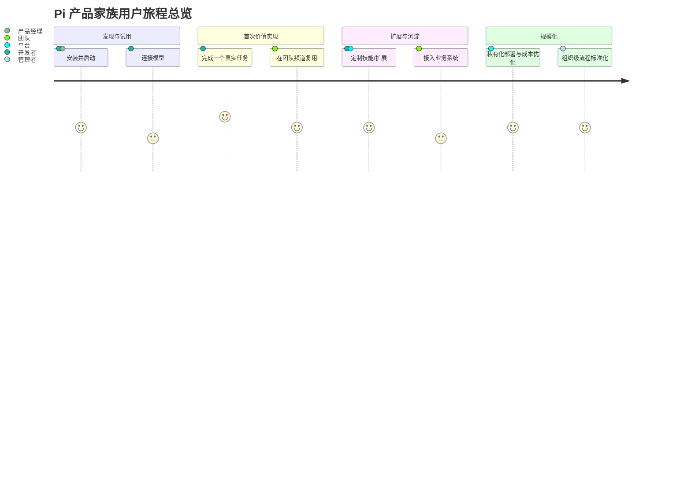
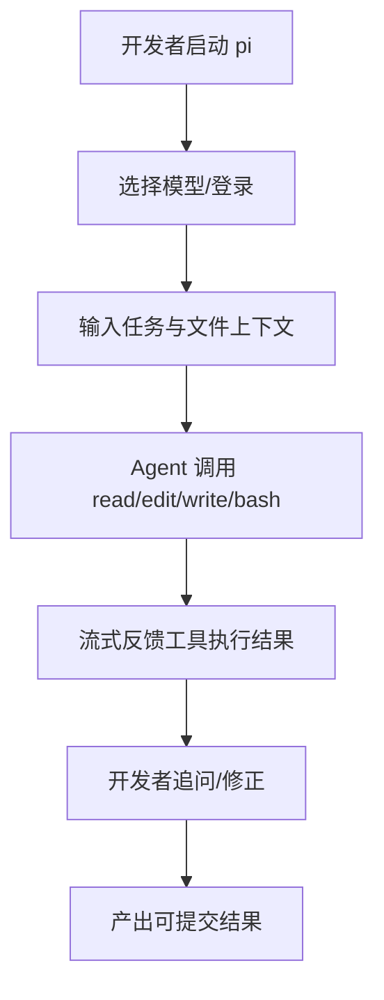
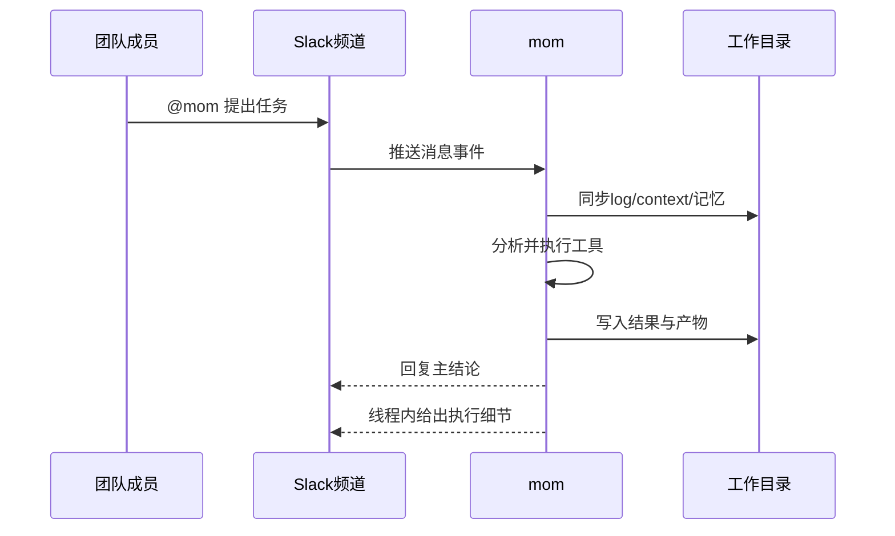
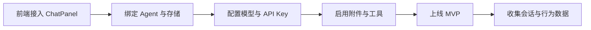
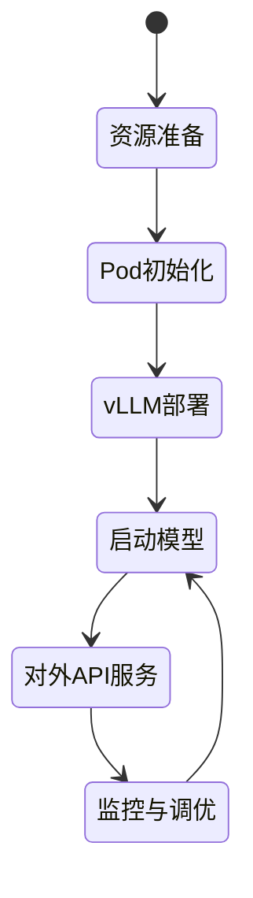
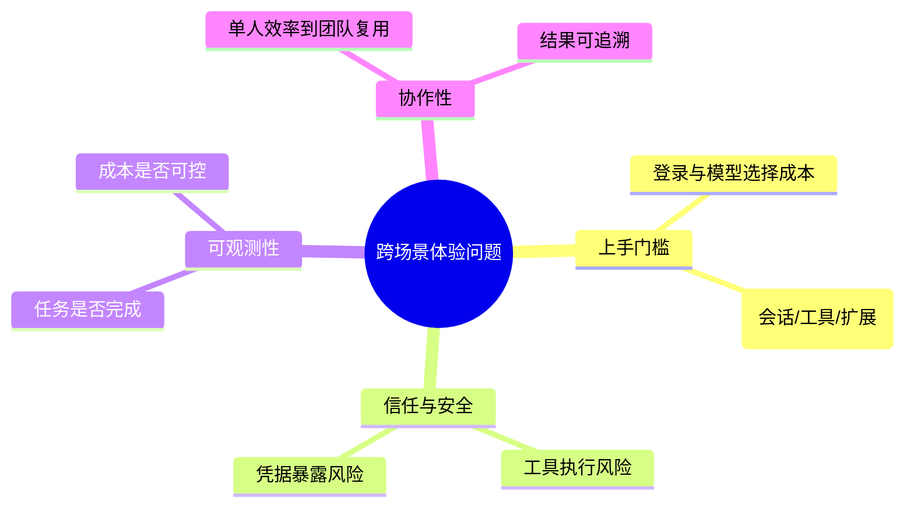

# 用户旅程与场景地图（非技术视角）

## 目录

- [1. 角色定义](#1-角色定义)
- [2. 关键用户旅程总览](#2-关键用户旅程总览)
- [3. 场景 A：开发者使用 pi-coding-agent](#3-场景-a开发者使用-pi-coding-agent)
- [4. 场景 B：团队在 Slack 中使用 mom](#4-场景-b团队在-slack-中使用-mom)
- [5. 场景 C：产品团队使用 web-ui 搭建 AI 页面](#5-场景-c产品团队使用-web-ui-搭建-ai-页面)
- [6. 场景 D：平台团队使用 pods 管理模型服务](#6-场景-d平台团队使用-pods-管理模型服务)
- [7. 跨场景关键体验问题](#7-跨场景关键体验问题)
- [8. 结论](#8-结论)
- [9. 可执行建议](#9-可执行建议)

## 1. 角色定义

- 个人开发者：追求“快”，希望一条指令完成分析、修改、验证。
- 团队协作者（Slack）：追求“可协同”，希望 AI 能在频道里承接任务。
- 产品经理：追求“可验证”，希望尽快看到可演示、可试用的 MVP。
- 平台/运维：追求“可控”，希望性能、成本、安全可管理。

## 2. 关键用户旅程总览

## 3. 场景 A：开发者使用 pi-coding-agent

### 3.1 目标

把“阅读代码 -> 修改 -> 验证”压缩到同一会话，降低切换成本。

### 3.2 旅程分步

### 3.3 产品逻辑重点

- 会话管理：支持恢复、分叉、压缩，减少长任务中断损失。
- 消息队列：任务执行时可插入“转向消息”和“后续消息”，提升并行思考能力。
- 可扩展机制：通过技能/扩展/模板，沉淀组织最佳实践。

## 4. 场景 B：团队在 Slack 中使用 mom

### 4.1 目标

让 AI 从“个人助手”升级为“团队共享执行者”。

### 4.2 旅程分步

### 4.3 产品逻辑重点

- 每个频道独立上下文，避免跨团队信息污染。
- 主消息简洁、线程细节详尽，兼顾可读性和审计性。
- 支持定时/周期事件，AI 可主动“被唤醒”执行巡检类任务。

## 5. 场景 C：产品团队使用 web-ui 搭建 AI 页面

### 5.1 目标

用组件化方式快速交付可用 AI 界面，不从零造轮子。

### 5.2 旅程分步

### 5.3 产品逻辑重点

- 组件即能力：消息、工具渲染、会话存储、设置弹窗等都可复用。
- 适合“业务团队驱动的快速试验”：先做 MVP，再按反馈迭代。
- 可接入自定义提供方，适配企业现有模型网关。

## 6. 场景 D：平台团队使用 pods 管理模型服务

### 6.1 目标

把“模型部署复杂度”打包成标准流程，提升可控性与性价比。

### 6.2 旅程分步

### 6.3 产品逻辑重点

- 预置模型配置降低试错门槛。
- OpenAI 兼容接口降低上层应用改造成本。
- 多模型多 GPU 调度直接影响单位成本与并发能力。

## 7. 跨场景关键体验问题

- 用户真正关心的不是“用了哪个模型”，而是“任务有没有完成、成本是否可接受”。
- 需要把底层技术细节抽象成面向业务的指标与面板。

## 8. 结论

- 该仓库覆盖了从个人到团队、从前端到基础设施的完整 AI 产品链路。
- 用户旅程的核心价值在“连续任务完成能力”，而不是一次性回答。
- 若要提升留存，关键在于把首个成功场景和组织复用能力做得更强。

## 9. 可执行建议

- 建议 1（高优先级）：定义“首个成功任务（First Task Success）”引导流程，减少首次流失。
- 建议 2（高优先级）：为 Slack 场景加入更明确的“线程摘要模板”，降低管理者阅读成本。
- 建议 3（中优先级）：在 Web 组件层提供行业模板（客服、运营、内部知识问答）加速 PM 试验。
- 建议 4（中优先级）：将 pods 的成本与性能指标可视化，帮助非技术决策者理解 ROI。

---

## 10. 建议继续阅读

- 下一篇：[`03-core-flows.md`](./03-core-flows.md)
- 对照代码目录：`packages/mom/`、`packages/web-ui/`、`packages/coding-agent/`

