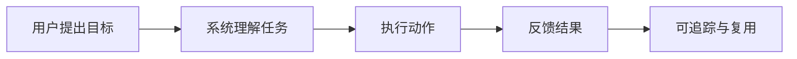
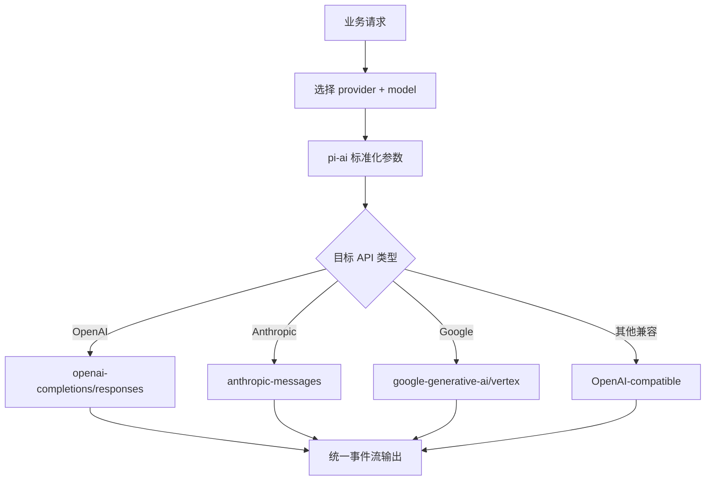
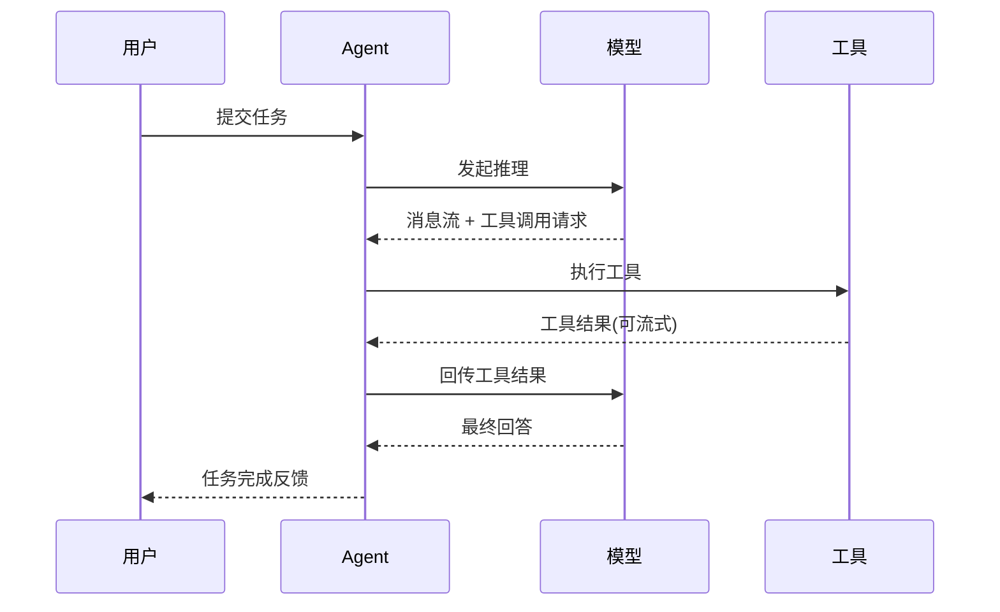
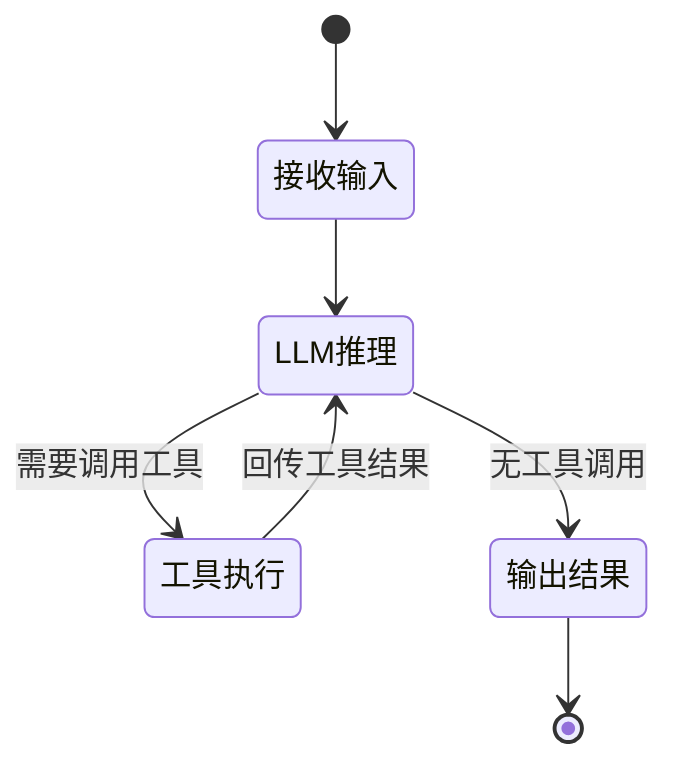
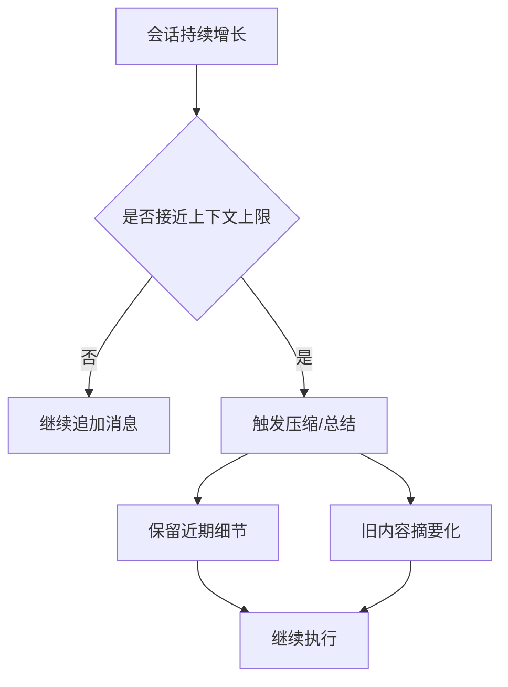
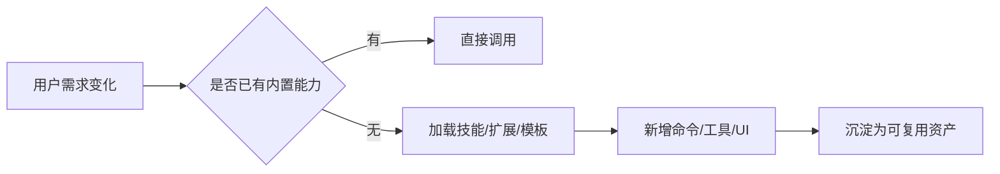
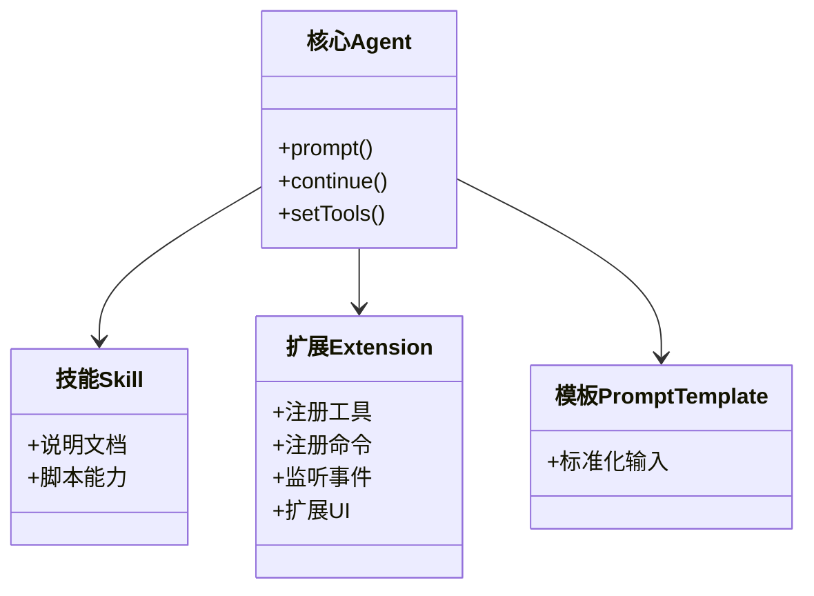
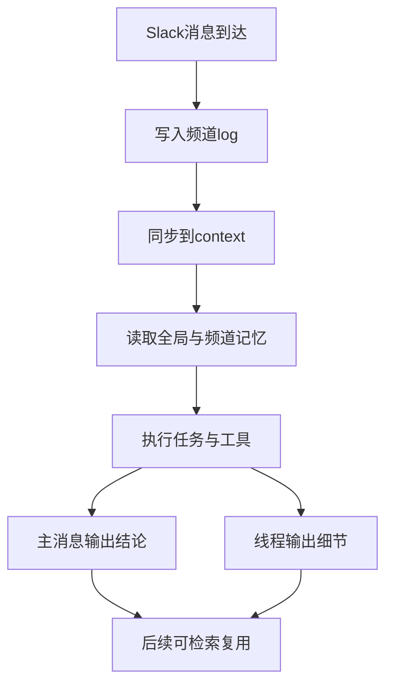
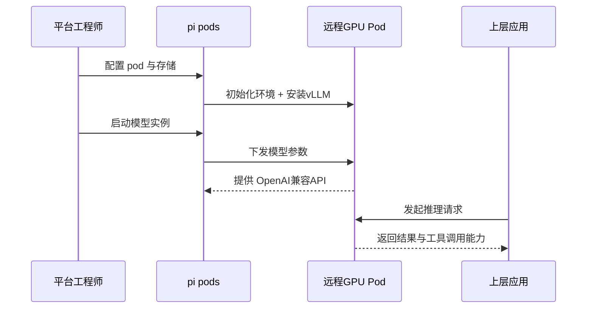
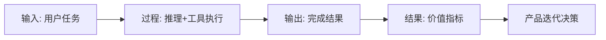

# 核心流程拆解（业务逻辑与关键节点）

## 目录

- [1. 为什么要看“核心流程”](#1-为什么要看核心流程)
- [2. 流程一：多模型统一接入](#2-流程一多模型统一接入)
- [3. 流程二：Agent 工具调用闭环](#3-流程二agent-工具调用闭环)
- [4. 流程三：会话管理与上下文压缩](#4-流程三会话管理与上下文压缩)
- [5. 流程四：扩展能力注入（技能/扩展/模板）](#5-流程四扩展能力注入技能扩展模板)
- [6. 流程五：团队协作与频道隔离（mom）](#6-流程五团队协作与频道隔离mom)
- [7. 流程六：模型部署与服务化（pods）](#7-流程六模型部署与服务化pods)
- [8. 横向指标体系建议](#8-横向指标体系建议)
- [9. 结论](#9-结论)
- [10. 可执行建议](#10-可执行建议)

## 1. 为什么要看“核心流程”

对产品经理而言，流程就是“价值如何被交付”。如果流程不闭环，功能再多也难形成稳定价值。

## 2. 流程一：多模型统一接入

### 2.1 业务意义

- 避免单一模型供应商锁定。
- 支持按成本/质量/速度切换模型。
- 上层应用不用为每个供应商重写一次。

### 2.2 关键流程

## 3. 流程二：Agent 工具调用闭环

### 3.1 业务意义

- 从“仅回答”升级为“可执行任务”。
- 可以落地到真实工作：读写文件、运行命令、提取文档、回写结果。

### 3.2 事件驱动循环

### 3.3 状态机视角

## 4. 流程三：会话管理与上下文压缩

### 4.1 业务意义

- 真实业务是多轮、多天、多分支，不是一次对话。
- 需要在上下文窗口受限下保持“连续性 + 可追溯”。

### 4.2 流程图

### 4.3 对产品的启示

- 压缩不是“删历史”，而是“保留业务连续性”。
- 需要给用户可见的压缩提示，增强信任。
- 会话树分叉能力天然适合“方案对比”和“试错回滚”。

## 5. 流程四：扩展能力注入（技能/扩展/模板）

### 5.1 业务意义

- 让产品从“通用工具”变成“团队专属工作台”。
- 降低平台团队重复开发压力，通过生态扩展满足长尾需求。

### 5.2 注入路径

### 5.3 类图视角

## 6. 流程五：团队协作与频道隔离（mom）

### 6.1 业务意义

- 同一机器人服务多团队时，必须做到上下文隔离。
- 需要把“过程细节”与“业务结论”分层展示。

### 6.2 流程图

## 7. 流程六：模型部署与服务化（pods）

### 7.1 业务意义

- 组织可按成本和数据要求选择自托管。
- 把复杂的 vLLM 配置标准化，减少平台接入门槛。

### 7.2 流程图

## 8. 横向指标体系建议

| 指标 | 说明 | 业务用途 |
|---|---|---|
| 任务完成率 | 用户目标是否真正完成 | 衡量产品实效 |
| 首次成功时长 | 从启动到第一次可用结果 | 衡量上手门槛 |
| 平均工具调用次数 | 每任务所需动作复杂度 | 识别流程冗余 |
| 成本/任务 | Token 与部署成本折算 | 评估可规模化 |
| 会话复用率 | 历史会话被继续的比例 | 衡量长期价值 |

## 9. 结论

- 仓库内的核心流程已经构成完整业务闭环：接入、执行、记忆、协作、部署。
- 产品竞争力取决于“流程效率 + 可靠性 + 可观测性”的综合表现。
- 要扩大商业价值，关键是将这些流程转成可量化的业务指标和标准化模板。

## 10. 可执行建议

- 建议 1（高优先级）：将“任务完成率”和“首次成功时长”做成统一看板，覆盖 CLI/Web/Slack。
- 建议 2（高优先级）：针对高频场景输出官方技能包，减少每个团队重复造扩展。
- 建议 3（中优先级）：补充“会话压缩可解释机制”，让用户知道哪些信息被摘要化。
- 建议 4（中优先级）：在 pods 场景提供“模型推荐矩阵”（质量/延迟/成本）辅助选型。

---

## 11. 建议继续阅读

- 下一篇：[`04-risk-and-opportunities.md`](./04-risk-and-opportunities.md)
- 对照代码目录：`packages/agent/`、`packages/ai/`、`packages/pods/`

