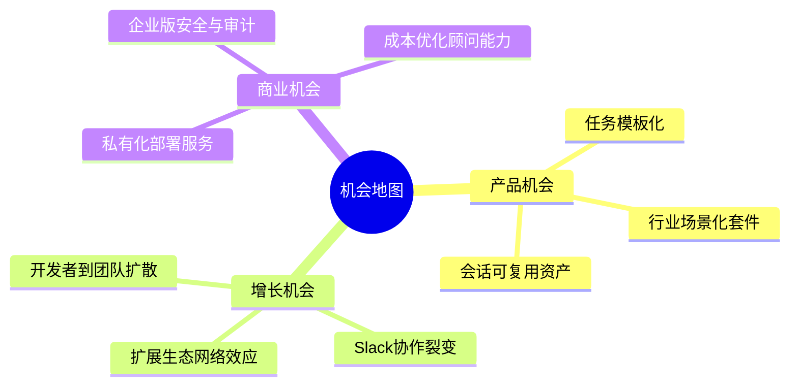
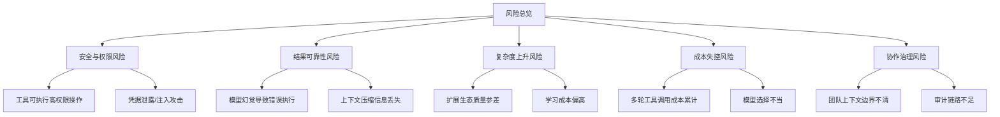
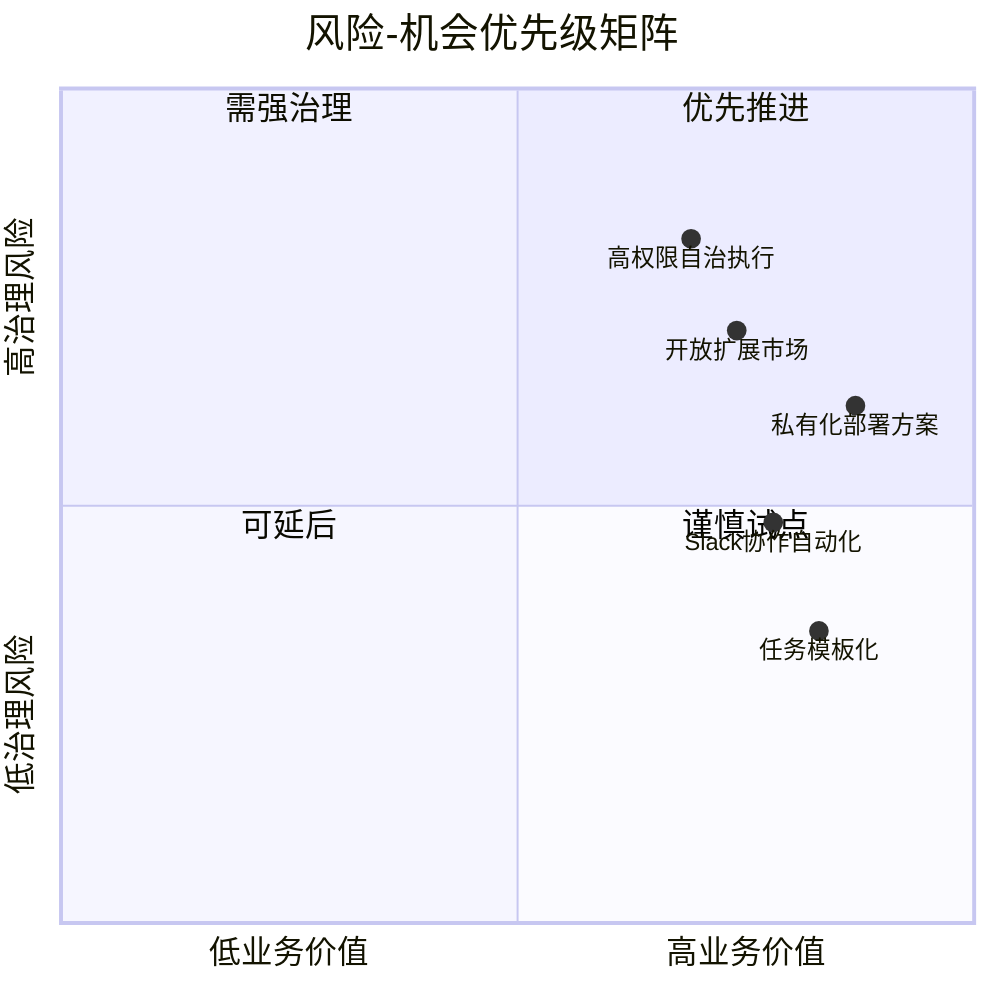
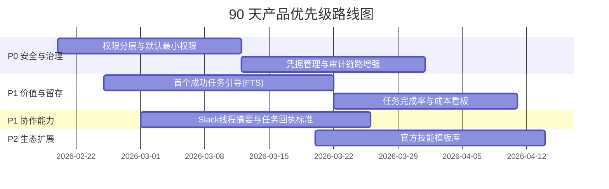
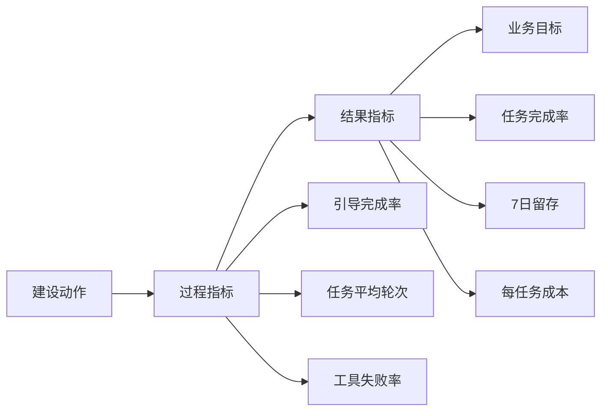

# 风险、机会与优先级建议（产品决策版）

## 目录

- [1. 决策者需要看什么](#1-决策者需要看什么)
- [2. 机会地图（从现有能力出发）](#2-机会地图从现有能力出发)
- [3. 核心风险地图](#3-核心风险地图)
- [4. 风险与机会联动关系](#4-风险与机会联动关系)
- [5. 优先级路线图（90 天）](#5-优先级路线图90-天)
- [6. 指标与验收标准](#6-指标与验收标准)
- [7. 结论](#7-结论)
- [8. 可执行建议](#8-可执行建议)

## 1. 决策者需要看什么

- 不是“功能是否先进”，而是“是否稳定交付业务结果”。
- 不是“模型参数是否更大”，而是“单位成本下是否完成更多任务”。
- 不是“单点亮点”，而是“从个人到团队再到组织部署的增长路径”。

## 2. 机会地图（从现有能力出发）

### 2.1 高价值机会点

- 场景产品化：将高频流程沉淀为“可直接执行模板”。
- 组织级协同：强化 `mom` 的跨角色协作能力（审批、通知、任务回执）。
- 成本治理：结合 `pods` 提供“同任务多模型成本对比”。

## 3. 核心风险地图

### 3.1 风险分级建议

| 风险 | 影响 | 发生概率 | 优先级 |
|---|---|---|---|
| 工具权限过大导致误操作 | 高 | 中 | P0 |
| 凭据泄露/提示注入 | 高 | 中 | P0 |
| 任务结果不稳定 | 高 | 中 | P1 |
| 学习曲线过陡导致流失 | 中 | 高 | P1 |
| 单任务成本不可控 | 中 | 中 | P1 |
| 扩展生态碎片化 | 中 | 中 | P2 |

## 4. 风险与机会联动关系

- 高价值且中低风险的事项应优先形成标准产品包。
- 高价值高风险事项（如高权限自治）要先做治理框架再扩量。

## 5. 优先级路线图（90 天）

### 5.1 路线图解读

- 先“稳住风险底线”（安全、审计、权限），再做增长放大。
- P1 聚焦真实业务结果：首次成功、持续完成、成本可见。
- P2 用生态扩展放大场景覆盖，不与核心稳定性争资源。

## 6. 指标与验收标准

| 目标 | 建议指标 | 阶段验收线 |
|---|---|---|
| 新用户快速上手 | 首次成功任务时间 | 下降 30% |
| 提升任务产出质量 | 任务完成率 | 提升 20% |
| 控制成本 | 每任务平均成本 | 下降 15% |
| 增强协作复用 | 团队频道周活跃任务数 | 提升 25% |

## 7. 结论

- 当前仓库具备“做大产品”的底盘，短板主要在治理可视化与场景化封装。
- 最关键的是先建立“可控执行”的信任基础，再扩展生态和商业化深度。
- 90 天内可通过 P0+P1 动作同时提升安全、留存和组织复用。

## 8. 可执行建议

- 建议 1（P0）：建立默认最小权限策略，区分读/写/执行级别并提供可视化确认记录。
- 建议 2（P0）：完善注入与凭据防护机制，形成审计闭环（谁在何时执行了什么）。
- 建议 3（P1）：上线“首个成功任务”引导与示例模板，缩短从安装到价值感知的路径。
- 建议 4（P1）：发布统一业务看板（完成率、成本、失败原因），指导后续版本迭代。
- 建议 5（P2）：建设官方技能模板库与质量分级机制，提升生态可用性与可信度。

---

## 9. 建议继续动作

- 回到导航页：[`README.md`](./README.md)
- 对照代码目录：`packages/mom/`、`packages/pods/`、`packages/web-ui/`

